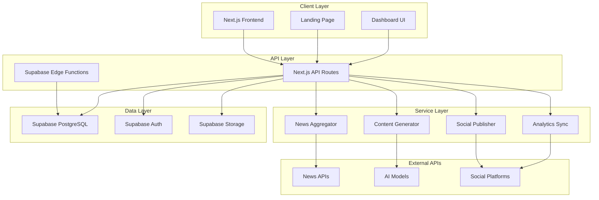
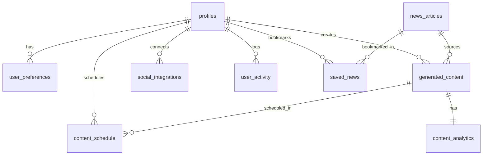

# SNN+ Platform Design Document

## Overview

SNN+ is a full-stack web application built with Next.js 14 (App Router) that provides an AI-powered content creation pipeline for social media. The system follows a three-stage architecture: (1) News Aggregation - fetching and filtering AI-related news from multiple sources, (2) Content Generation - transforming news into platform-specific posts using AI models, and (3) Distribution - publishing content to connected social media accounts with analytics tracking.

The platform uses a serverless architecture hosted on Vercel with Supabase providing PostgreSQL database, authentication, and storage. The frontend is built with TypeScript, Tailwind CSS, and shadcn/ui components. The backend consists of Next.js API routes and Supabase Edge Functions for serverless compute.

## Architecture

### High-Level Architecture



### Technology Stack

**Frontend:**
- Next.js 14 with App Router and TypeScript
- Tailwind CSS for styling
- shadcn/ui for component library
- Zustand for state management
- React Hook Form + Zod for form validation
- Recharts for analytics visualization

**Backend:**
- Next.js API Routes for serverless endpoints
- Supabase Edge Functions for background jobs
- Supabase PostgreSQL with Row Level Security
- Supabase Auth for authentication

**External Services:**
- News APIs: Serper, NewsAPI.org, Mediastack, gnews.io, HackerNews
- AI Models: OpenAI GPT-4, Anthropic Claude, Google Gemini
- Social Platforms: LinkedIn, Twitter/X, Instagram, Facebook, Threads

**DevOps:**
- Vercel for hosting and CI/CD
- GitHub for version control
- Sentry for error monitoring

## Components and Interfaces

### Core Components

#### 1. Authentication System

**Components:**
- `AuthProvider`: Context provider for authentication state
- `LoginForm`: Email/password login component
- `SignupForm`: User registration component
- `OAuthButtons`: Social login buttons (Google, GitHub, Apple)
- `ProtectedRoute`: HOC for route protection

**Interfaces:**
```typescript
interface User {
  id: string;
  email: string;
  full_name: string | null;
  avatar_url: string | null;
  role: 'free_user' | 'pro_user' | 'admin';
  onboarding_completed: boolean;
  created_at: string;
  updated_at: string;
}

interface UserPreferences {
  id: string;
  user_id: string;
  notification_email: boolean;
  notification_push: boolean;
  notification_weekly_digest: boolean;
  notification_breaking_news: boolean;
  content_tone: 'professional' | 'friendly' | 'witty' | 'formal';
  preferred_platforms: string[];
  created_at: string;
  updated_at: string;
}

interface AuthState {
  user: User | null;
  preferences: UserPreferences | null;
  loading: boolean;
  signIn: (email: string, password: string) => Promise<void>;
  signUp: (email: string, password: string, fullName: string) => Promise<void>;
  signInWithOAuth: (provider: 'google' | 'github' | 'apple') => Promise<void>;
  signOut: () => Promise<void>;
}
```

#### 2. News Aggregation System

**Components:**
- `NewsAggregator`: Orchestrates multi-API news fetching
- `SerperClient`: Serper API integration
- `NewsAPIClient`: NewsAPI.org integration
- `MediastackClient`: Mediastack API integration
- `GNewsClient`: gnews.io API integration
- `HackerNewsClient`: HackerNews API integration
- `NewsFilter`: Filters and scores articles for AI relevance
- `NewsFeed`: UI component displaying news articles

**Interfaces:**
```typescript
interface NewsArticle {
  id: string;
  title: string;
  description: string | null;
  content: string | null;
  url: string;
  source: string;
  author: string | null;
  published_at: string;
  image_url: string | null;
  category: string[];
  keywords: string[] | null;
  sentiment: 'positive' | 'neutral' | 'negative' | null;
  relevance_score: number | null;
  fetched_at: string;
  is_active: boolean;
  created_at: string;
}

interface NewsAPIResponse {
  articles: NewsArticle[];
  totalResults: number;
  source: string;
}

interface NewsAggregatorConfig {
  maxArticles: number;
  timeWindow: number; // hours
  minRelevanceScore: number;
  categories: string[];
}
```

#### 3. AI Content Generation Engine

**Components:**
- `ContentGenerator`: Orchestrates AI content generation
- `OpenAIProvider`: OpenAI GPT-4 integration
- `AnthropicProvider`: Anthropic Claude integration
- `GoogleAIProvider`: Google Gemini integration
- `PlatformPrompts`: Platform-specific prompt templates
- `ContentPreview`: UI component for previewing generated content

**Interfaces:**
```typescript
interface GeneratedContent {
  id: string;
  user_id: string;
  article_id: string | null;
  platform: 'linkedin' | 'twitter' | 'instagram' | 'facebook' | 'threads';
  content_type: 'post' | 'thread' | 'story' | 'carousel';
  generated_text: string;
  generated_hashtags: string[] | null;
  image_url: string | null;
  tone: string;
  ai_model: string;
  generation_time_ms: number | null;
  is_published: boolean;
  published_at: string | null;
  created_at: string;
  updated_at: string;
}

interface GenerationRequest {
  article: NewsArticle;
  platform: 'linkedin' | 'twitter' | 'instagram' | 'facebook' | 'threads';
  tone: 'professional' | 'friendly' | 'witty' | 'formal';
  contentType: 'post' | 'thread' | 'story' | 'carousel';
}

interface GenerationResponse {
  content: GeneratedContent;
  success: boolean;
  error?: string;
}

interface AIProvider {
  generate(prompt: string, config: GenerationConfig): Promise<string>;
  isAvailable(): Promise<boolean>;
}

interface GenerationConfig {
  maxTokens: number;
  temperature: number;
  model: string;
}
```

#### 4. Social Media Integration System

**Components:**
- `SocialIntegrationManager`: Manages OAuth flows and connections
- `LinkedInPublisher`: LinkedIn posting integration
- `TwitterPublisher`: Twitter/X posting integration
- `InstagramPublisher`: Instagram posting integration
- `FacebookPublisher`: Facebook posting integration
- `ThreadsPublisher`: Threads posting integration
- `TokenManager`: Handles token refresh and encryption
- `IntegrationCard`: UI component for connection status

**Interfaces:**
```typescript
interface SocialIntegration {
  id: string;
  user_id: string;
  platform: 'linkedin' | 'twitter' | 'instagram' | 'facebook' | 'threads';
  is_connected: boolean;
  access_token: string | null;
  refresh_token: string | null;
  token_expires_at: string | null;
  platform_user_id: string | null;
  platform_username: string | null;
  connected_at: string | null;
  last_used_at: string | null;
  created_at: string;
  updated_at: string;
}

interface PublishRequest {
  content: GeneratedContent;
  integration: SocialIntegration;
  scheduledFor?: string;
}

interface PublishResponse {
  success: boolean;
  platform_post_id?: string;
  error?: string;
}

interface OAuthConfig {
  clientId: string;
  clientSecret: string;
  redirectUri: string;
  scopes: string[];
}
```

#### 5. Analytics and Performance Tracking

**Components:**
- `AnalyticsSyncService`: Fetches metrics from social platforms
- `AnalyticsDashboard`: UI component displaying charts and metrics
- `EngagementChart`: Recharts component for engagement visualization
- `PlatformComparison`: Comparative analytics across platforms
- `MetricsCalculator`: Computes engagement rates and trends

**Interfaces:**
```typescript
interface ContentAnalytics {
  id: string;
  content_id: string;
  platform: string;
  impressions: number;
  engagements: number;
  likes: number;
  comments: number;
  shares: number;
  clicks: number;
  engagement_rate: number | null;
  synced_at: string;
  created_at: string;
}

interface AnalyticsMetrics {
  totalImpressions: number;
  totalEngagements: number;
  averageEngagementRate: number;
  topPerformingContent: GeneratedContent[];
  platformBreakdown: Record<string, PlatformMetrics>;
  growthTrend: TrendData[];
}

interface PlatformMetrics {
  platform: string;
  impressions: number;
  engagements: number;
  engagementRate: number;
  postCount: number;
}

interface TrendData {
  date: string;
  impressions: number;
  engagements: number;
  engagementRate: number;
}
```

#### 6. Content Scheduling System

**Components:**
- `ContentScheduler`: Manages scheduled content publication
- `ScheduleCalendar`: UI component for calendar view
- `ScheduleManager`: Background service for executing scheduled posts

**Interfaces:**
```typescript
interface ContentSchedule {
  id: string;
  user_id: string;
  content_id: string;
  scheduled_for: string;
  is_published: boolean;
  published_at: string | null;
  failed: boolean;
  error_message: string | null;
  created_at: string;
  updated_at: string;
}

interface ScheduleRequest {
  contentId: string;
  scheduledFor: Date;
  platform: string;
}
```

## Data Models

### Database Schema

The application uses Supabase PostgreSQL with the following tables:

#### Core Tables

**profiles**
- Primary user profile data
- Links to auth.users via foreign key
- Stores role, onboarding status, and basic info

**user_preferences**
- User-specific settings and preferences
- Content tone, notification settings, preferred platforms
- One-to-one relationship with profiles

**news_articles**
- Aggregated news content
- Indexed on published_at and category for performance
- Unique constraint on URL to prevent duplicates

**generated_content**
- AI-generated social media posts
- Links to news_articles and profiles
- Stores generation metadata (model, time, tone)

**social_integrations**
- OAuth tokens and connection status for social platforms
- Encrypted token storage
- Unique constraint on (user_id, platform)

**content_analytics**
- Performance metrics for published content
- One-to-one relationship with generated_content
- Stores impressions, engagements, and calculated rates

**user_activity**
- Activity logging for analytics and debugging
- JSONB metadata field for flexible data storage

**saved_news**
- User bookmarks for news articles
- Unique constraint on (user_id, article_id)

**content_schedule**
- Scheduled content publication queue
- Tracks publication status and errors

### Data Relationships



### Row Level Security (RLS) Policies

All tables implement RLS policies to ensure data isolation:

- **profiles**: Users can only view/update their own profile
- **user_preferences**: Users can only view/update their own preferences
- **generated_content**: Users can only view/create/update their own content
- **social_integrations**: Users can only view/update their own integrations
- **content_analytics**: Users can only view analytics for their own content
- **user_activity**: Users can only view their own activity logs
- **saved_news**: Users can only view/create/delete their own bookmarks
- **content_schedule**: Users can only view/create/update their own schedules
- **news_articles**: All authenticated users have read access (public news)


## Correctness Properties

*A property is a characteristic or behavior that should hold true across all valid executions of a system—essentially, a formal statement about what the system should do. Properties serve as the bridge between human-readable specifications and machine-verifiable correctness guarantees.*

### Authentication and Authorization Properties

**Property 1: Account creation with valid credentials**
*For any* valid email and password combination, creating an account should result in a new user record with encrypted password storage in the database.
**Validates: Requirements 1.1**

**Property 2: Unauthenticated dashboard access redirect**
*For any* dashboard route, when accessed by an unauthenticated user, the system should redirect to the login page.
**Validates: Requirements 1.3**

**Property 3: Authenticated auth page redirect**
*For any* auth page (login or signup), when accessed by an authenticated user, the system should redirect to the dashboard.
**Validates: Requirements 1.4**

### Profile and Preferences Properties

**Property 4: Profile update persistence**
*For any* valid profile update (full name, avatar), the changes should be persisted to the profiles table and retrievable in subsequent queries.
**Validates: Requirements 2.1**

**Property 5: Preferences update persistence**
*For any* valid preference update (tone, platforms, notifications), the changes should be persisted to the user_preferences table and retrievable in subsequent queries.
**Validates: Requirements 2.2, 2.3**

**Property 6: User data isolation through RLS**
*For any* user querying their profile, preferences, content, or integrations, the system should return only data where the user_id matches auth.uid().
**Validates: Requirements 2.4, 10.2, 10.3, 10.4, 10.5**

### News Aggregation Properties

**Property 7: Article deduplication by URL**
*For any* news article with a URL that already exists in the database, attempting to store it should be rejected by the uniqueness constraint.
**Validates: Requirements 3.6**

**Property 8: News feed time filtering**
*For any* news feed query, the returned articles should have published_at timestamps within the last 48 hours, sorted in descending order.
**Validates: Requirements 3.7**

**Property 9: AI relevance filtering**
*For any* batch of articles received from news APIs, only articles meeting the minimum relevance score threshold should be stored in the database.
**Validates: Requirements 3.5**

### Content Generation Properties

**Property 10: LinkedIn character constraints**
*For any* content generated for LinkedIn, the text length should be between 1300 and 3000 characters.
**Validates: Requirements 4.4**

**Property 11: Twitter character constraints**
*For any* content generated for Twitter/X, either the text should be within 280 characters, or if a thread, each tweet should be within 280 characters and the thread should have at most 10 tweets.
**Validates: Requirements 4.5**

**Property 12: Instagram hashtag constraints**
*For any* content generated for Instagram, the caption should be at most 2200 characters and include between 10 and 15 hashtags.
**Validates: Requirements 4.6**

**Property 13: Facebook paragraph structure**
*For any* content generated for Facebook, the text should consist of 1 to 3 paragraphs.
**Validates: Requirements 4.7**

**Property 14: Content generation metadata persistence**
*For any* completed content generation, the system should store the generated text along with metadata (AI model, generation time, tone) in the generated_content table.
**Validates: Requirements 4.9**

**Property 15: Tone application consistency**
*For any* content generation request with a specified tone, the generated content should reflect that tone in the output text.
**Validates: Requirements 4.10**

### Content Management Properties

**Property 16: Content library user isolation**
*For any* user accessing the content library, only content where user_id matches the authenticated user should be displayed.
**Validates: Requirements 5.1**

**Property 17: Platform filter accuracy**
*For any* platform filter applied to the content library, only content matching the selected platform should be displayed.
**Validates: Requirements 5.2**

**Property 18: Date range filter accuracy**
*For any* date range filter applied to the content library, only content with created_at timestamps within that range should be displayed.
**Validates: Requirements 5.3**

**Property 19: Bookmark persistence**
*For any* news article bookmarked by a user, an entry should be created in the saved_news table and retrievable in subsequent queries.
**Validates: Requirements 5.5**

**Property 20: Saved articles display completeness**
*For any* user viewing saved articles, all entries in the saved_news table for that user should be displayed with their associated article data.
**Validates: Requirements 5.6**

### Social Integration Properties

**Property 21: Token encryption and storage**
*For any* successful OAuth authorization, the access token and refresh token should be encrypted and stored in the social_integrations table.
**Validates: Requirements 6.2**

**Property 22: Integration status display accuracy**
*For any* user viewing integration status, the displayed connection state and last_used_at timestamp should match the data in the social_integrations table.
**Validates: Requirements 6.6**

### Content Scheduling Properties

**Property 23: Schedule entry creation**
*For any* content scheduled for future publication, an entry should be created in the content_schedule table with the correct scheduled_for timestamp.
**Validates: Requirements 7.1**

**Property 24: Calendar display completeness**
*For any* user viewing the content calendar, all entries in the content_schedule table for that user should be displayed organized by date.
**Validates: Requirements 7.5**

### Analytics Properties

**Property 25: Analytics metrics persistence**
*For any* analytics data retrieved from social platforms, all metrics (impressions, engagements, likes, comments, shares, clicks) should be stored in the content_analytics table.
**Validates: Requirements 8.2**

**Property 26: Engagement rate calculation accuracy**
*For any* content with analytics data, the engagement rate should be calculated as (engagements / impressions) * 100.
**Validates: Requirements 8.4**

**Property 27: Analytics dashboard data accuracy**
*For any* user viewing the analytics dashboard, the displayed charts should reflect the metrics stored in the content_analytics table.
**Validates: Requirements 8.3**

**Property 28: Platform comparison completeness**
*For any* user comparing platforms, metrics should be displayed for each platform where the user has connected integrations.
**Validates: Requirements 8.5**

### Security and Access Control Properties

**Property 29: RLS policy enforcement**
*For any* table with RLS enabled, queries should only return rows that satisfy the RLS policy conditions based on auth.uid().
**Validates: Requirements 10.1**

**Property 30: Public news article access**
*For any* authenticated user querying the news_articles table, all articles should be accessible regardless of who fetched them.
**Validates: Requirements 10.6**

### Error Handling Properties

**Property 31: API error logging and messaging**
*For any* failed API request, the system should log error details and display a user-friendly error message.
**Validates: Requirements 11.1**

**Property 32: Cache header implementation**
*For any* cacheable API response, appropriate cache-control headers should be set to enable client-side caching.
**Validates: Requirements 12.4**

### Activity Logging Properties

**Property 33: Activity metadata completeness**
*For any* logged user activity, the entry should include the activity_type and relevant metadata in the jsonb metadata field.
**Validates: Requirements 13.5**

### Accessibility Properties

**Property 34: Image alt text presence**
*For any* image displayed in the application, a descriptive alt attribute should be present.
**Validates: Requirements 14.3**

**Property 35: Form label and ARIA completeness**
*For any* form element, proper label elements and ARIA attributes should be present for accessibility.
**Validates: Requirements 14.4**

## Error Handling

### Error Categories

**1. Authentication Errors**
- Invalid credentials: Display "Invalid email or password" message
- OAuth failures: Display "Authentication failed. Please try again" with provider name
- Session expiration: Redirect to login with "Your session has expired" message
- Account already exists: Display "An account with this email already exists"

**2. API Integration Errors**
- News API failures: Automatically fallback to next API in chain, log failure
- AI model failures: Automatically fallback to next model, log failure with model name
- Social platform API errors: Display platform-specific error message, mark integration as needs attention
- Rate limiting: Implement exponential backoff, display "Service temporarily unavailable" if all retries fail

**3. Database Errors**
- Connection failures: Retry with exponential backoff, display "Database connection error" if persistent
- Constraint violations: Display user-friendly message (e.g., "This article has already been saved")
- RLS policy violations: Return 403 Forbidden with "Access denied" message
- Transaction failures: Rollback and return appropriate error response

**4. Validation Errors**
- Form validation: Display inline error messages with specific field issues
- Content generation constraints: Display "Content exceeds platform limits" with specific constraint
- Invalid file uploads: Display "Invalid file type or size" with requirements

**5. Network Errors**
- Timeout errors: Retry with exponential backoff, display "Request timed out" after max retries
- Connection errors: Display "Network connection error. Please check your internet connection"
- CORS errors: Log for debugging, display generic "Request failed" message to user

### Error Handling Strategy

**Logging:**
- All errors logged to Sentry with context (user ID, request details, stack trace)
- Critical errors trigger immediate alerts
- Error logs include timestamp, error type, and recovery actions taken

**User Feedback:**
- Toast notifications for transient errors
- Inline error messages for form validation
- Error pages for critical failures (500, 404)
- Loading states during retry attempts

**Recovery:**
- Automatic retry with exponential backoff for transient failures
- Fallback chains for external API dependencies
- Graceful degradation (e.g., show cached data if fresh data unavailable)
- Clear recovery actions for user (e.g., "Reconnect your account")

**Error Boundaries:**
- React error boundaries at route level to catch rendering errors
- Fallback UI with "Something went wrong" message and reload option
- Error details logged but not exposed to users in production

## Testing Strategy

### Unit Testing

**Framework:** Jest with React Testing Library

**Coverage Areas:**
- Utility functions (date formatting, text processing, calculations)
- Data transformation functions (API response parsing, data normalization)
- Validation logic (form validators, content constraints)
- Business logic (engagement rate calculation, relevance scoring)
- React component rendering and interactions
- Custom hooks behavior

**Example Unit Tests:**
- Test engagement rate calculation with various input values
- Test news article relevance scoring algorithm
- Test platform-specific content constraint validation
- Test date filtering logic for news feed
- Test RLS policy helper functions
- Test token encryption/decryption utilities

### Property-Based Testing

**Framework:** fast-check (JavaScript property-based testing library)

**Configuration:**
- Minimum 100 iterations per property test
- Each property test tagged with format: `**Feature: snn-platform, Property {number}: {property_text}**`
- Generators for complex data types (users, articles, content, integrations)

**Property Test Coverage:**

**Authentication Properties:**
- Property 1: Account creation with valid credentials
  - Generator: Random valid email/password combinations
  - Assertion: Account created with encrypted password

- Property 2: Unauthenticated dashboard access redirect
  - Generator: Random dashboard routes
  - Assertion: Redirect to login page

- Property 3: Authenticated auth page redirect
  - Generator: Random auth pages
  - Assertion: Redirect to dashboard

**Profile Properties:**
- Property 4: Profile update persistence
  - Generator: Random valid profile data
  - Assertion: Updates persisted and retrievable

- Property 5: Preferences update persistence
  - Generator: Random valid preferences
  - Assertion: Updates persisted and retrievable

- Property 6: User data isolation through RLS
  - Generator: Multiple users with data
  - Assertion: Each user sees only their data

**News Aggregation Properties:**
- Property 7: Article deduplication by URL
  - Generator: Articles with duplicate URLs
  - Assertion: Duplicates rejected

- Property 8: News feed time filtering
  - Generator: Articles with various timestamps
  - Assertion: Only last 48 hours shown, sorted descending

- Property 9: AI relevance filtering
  - Generator: Articles with various relevance scores
  - Assertion: Only articles above threshold stored

**Content Generation Properties:**
- Property 10: LinkedIn character constraints
  - Generator: Random articles for LinkedIn generation
  - Assertion: Output between 1300-3000 characters

- Property 11: Twitter character constraints
  - Generator: Random articles for Twitter generation
  - Assertion: Single tweet ≤280 chars or thread ≤10 tweets with each ≤280 chars

- Property 12: Instagram hashtag constraints
  - Generator: Random articles for Instagram generation
  - Assertion: Caption ≤2200 chars with 10-15 hashtags

- Property 13: Facebook paragraph structure
  - Generator: Random articles for Facebook generation
  - Assertion: Output has 1-3 paragraphs

- Property 14: Content generation metadata persistence
  - Generator: Random generation requests
  - Assertion: All metadata stored correctly

- Property 15: Tone application consistency
  - Generator: Random articles with various tones
  - Assertion: Generated content reflects specified tone

**Content Management Properties:**
- Property 16: Content library user isolation
  - Generator: Multiple users with content
  - Assertion: Each user sees only their content

- Property 17: Platform filter accuracy
  - Generator: Content for various platforms
  - Assertion: Filter returns only matching platform

- Property 18: Date range filter accuracy
  - Generator: Content with various dates
  - Assertion: Filter returns only content in range

- Property 19: Bookmark persistence
  - Generator: Random bookmark actions
  - Assertion: Bookmarks persisted and retrievable

- Property 20: Saved articles display completeness
  - Generator: Users with various saved articles
  - Assertion: All saved articles displayed

**Social Integration Properties:**
- Property 21: Token encryption and storage
  - Generator: Random OAuth tokens
  - Assertion: Tokens encrypted and stored

- Property 22: Integration status display accuracy
  - Generator: Various integration states
  - Assertion: Display matches database state

**Scheduling Properties:**
- Property 23: Schedule entry creation
  - Generator: Random schedule requests
  - Assertion: Entries created with correct timestamps

- Property 24: Calendar display completeness
  - Generator: Users with various scheduled content
  - Assertion: All scheduled content displayed

**Analytics Properties:**
- Property 25: Analytics metrics persistence
  - Generator: Random analytics data
  - Assertion: All metrics stored correctly

- Property 26: Engagement rate calculation accuracy
  - Generator: Random impression/engagement values
  - Assertion: Rate = (engagements / impressions) * 100

- Property 27: Analytics dashboard data accuracy
  - Generator: Various analytics data sets
  - Assertion: Charts reflect stored metrics

- Property 28: Platform comparison completeness
  - Generator: Users with multiple platform integrations
  - Assertion: Metrics shown for all connected platforms

**Security Properties:**
- Property 29: RLS policy enforcement
  - Generator: Multiple users querying various tables
  - Assertion: Only authorized data returned

- Property 30: Public news article access
  - Generator: Various authenticated users
  - Assertion: All users can access all articles

**Error Handling Properties:**
- Property 31: API error logging and messaging
  - Generator: Various API failure scenarios
  - Assertion: Errors logged and user-friendly messages shown

- Property 32: Cache header implementation
  - Generator: Various cacheable responses
  - Assertion: Appropriate cache headers set

**Activity Logging Properties:**
- Property 33: Activity metadata completeness
  - Generator: Various user activities
  - Assertion: All activities logged with metadata

**Accessibility Properties:**
- Property 34: Image alt text presence
  - Generator: Various image components
  - Assertion: All images have alt attributes

- Property 35: Form label and ARIA completeness
  - Generator: Various form components
  - Assertion: All form elements have labels and ARIA attributes

### Integration Testing

**Framework:** Playwright for E2E testing

**Test Scenarios:**
- Complete user signup and onboarding flow
- OAuth authentication flow (mocked providers)
- News article fetching and display
- Content generation for all platforms
- Social platform connection flow (mocked OAuth)
- Content publishing flow (mocked platform APIs)
- Analytics data sync and display
- Content scheduling and calendar view
- Profile and preferences updates
- Error handling and recovery flows

### Performance Testing

**Tools:** Lighthouse CI, WebPageTest

**Metrics:**
- Landing page load time < 2 seconds
- Dashboard initial render < 2 seconds
- Content generation response < 5 seconds
- Lighthouse performance score > 90
- Lighthouse accessibility score > 90
- First Contentful Paint < 1.5 seconds
- Time to Interactive < 3 seconds

### Security Testing

**Areas:**
- RLS policy enforcement (test with multiple user contexts)
- SQL injection prevention (parameterized queries)
- XSS prevention (input sanitization, CSP headers)
- CSRF protection (token validation)
- Token encryption (verify encrypted storage)
- OAuth security (state parameter, PKCE)
- Rate limiting (test API throttling)
- Input validation (test boundary conditions)

## Deployment Architecture

### Infrastructure

**Frontend Hosting:** Vercel
- Automatic deployments from main branch
- Preview deployments for pull requests
- Edge network for global CDN
- Automatic HTTPS with SSL certificates

**Backend Services:** Supabase
- PostgreSQL database with automatic backups
- Authentication service with OAuth providers
- Storage for user-uploaded media
- Edge Functions for background jobs

**Monitoring:** Sentry + Vercel Analytics
- Error tracking and alerting
- Performance monitoring
- User session replay
- Custom event tracking

### Environment Configuration

**Development:**
- Local Next.js dev server
- Local Supabase instance (Docker)
- Mock external APIs for testing
- Hot module replacement enabled

**Staging:**
- Vercel preview deployment
- Staging Supabase project
- Real external APIs with test accounts
- Feature flags for experimental features

**Production:**
- Vercel production deployment
- Production Supabase project
- Real external APIs with production keys
- Feature flags for gradual rollouts

### CI/CD Pipeline

**GitHub Actions Workflow:**
1. Run linting (ESLint, Prettier)
2. Run type checking (TypeScript)
3. Run unit tests (Jest)
4. Run property-based tests (fast-check)
5. Build application
6. Run integration tests (Playwright)
7. Deploy to Vercel (automatic on main branch)
8. Run Lighthouse audit on deployed preview
9. Notify team of deployment status

### Monitoring and Alerting

**Error Monitoring:**
- Sentry captures all unhandled errors
- Alert on error rate > 1% of requests
- Alert on critical errors (database failures, auth failures)
- Daily error digest email

**Performance Monitoring:**
- Vercel Analytics tracks Core Web Vitals
- Alert on performance degradation > 20%
- Monitor API response times
- Track database query performance

**Uptime Monitoring:**
- Ping health check endpoint every 5 minutes
- Alert on downtime > 2 minutes
- Monitor external API availability
- Track OAuth provider status

### Backup and Recovery

**Database Backups:**
- Supabase automatic daily backups (retained 7 days)
- Weekly full backups (retained 30 days)
- Point-in-time recovery available

**Disaster Recovery:**
- Database restore from backup < 1 hour
- Application redeployment < 10 minutes
- DNS failover to backup region (if needed)
- Recovery Time Objective (RTO): 2 hours
- Recovery Point Objective (RPO): 24 hours

## Security Considerations

### Authentication Security

- Passwords hashed with bcrypt (cost factor 12)
- OAuth tokens encrypted at rest using AES-256
- Session tokens use secure, httpOnly cookies
- CSRF protection on all state-changing operations
- Rate limiting on authentication endpoints (5 attempts per 15 minutes)

### Data Security

- All database connections use SSL/TLS
- Row Level Security enforced on all user data tables
- Sensitive data (tokens, passwords) encrypted at rest
- API keys stored in environment variables, never in code
- Regular security audits and dependency updates

### API Security

- Rate limiting on all API endpoints
- Input validation and sanitization
- CORS configured for allowed origins only
- API authentication required for all protected endpoints
- Request size limits to prevent DoS attacks

### Compliance

- GDPR compliance for EU users (data export, deletion)
- Privacy policy and terms of service
- Cookie consent banner
- User data retention policies
- Audit logs for data access and modifications
